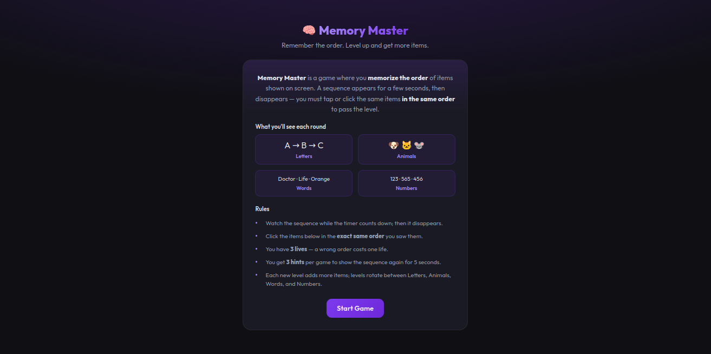
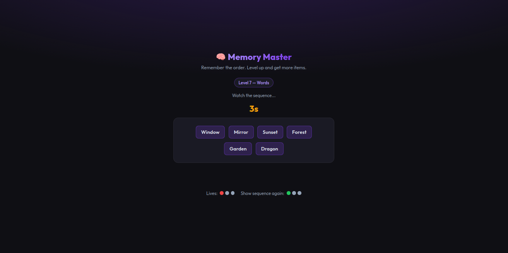
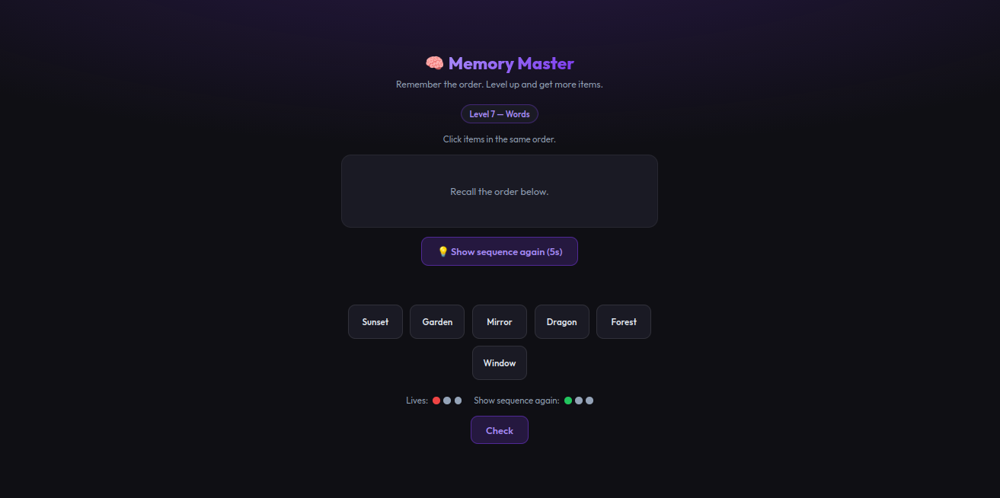

# Memory Master

A browser-based memory game where you memorize the **order** of items (letters, animals, words, or numbers) and reproduce the same sequence to advance through levels.

---

## Preview

| Start screen | Memorize phase | Recall phase |
|--------------|----------------|--------------|
|  |  |  |
| Intro, level types, rules & Start Game | Sequence + countdown timer | Choices, hint button, Check / Next Level |

---

## How to Play

1. **Start Game** — Click "Start Game" on the home screen.
2. **Memorize** — A sequence of items appears with a countdown timer. Remember the **exact order**.
3. **Recall** — After the sequence disappears, click the items below **in the same order** you saw them.
4. **Check** — Click "Check" to see if your order is correct.
5. **Next Level** — Get it right to advance; each level adds more items and rotates the type.

---

## Game Rules

| Rule | Description |
|------|-------------|
| **Order matters** | You must click items in the **exact same order** they were shown. |
| **Timer** | The sequence is visible only while the timer counts down; then it disappears. |
| **Lives** | You have **3 lives**. A wrong order costs one life. Game over when lives reach 0. |
| **Hints** | You get **3 hints** per game. Each hint shows the sequence again for **5 seconds** during the recall phase. |
| **Level types** | Levels rotate: **Letters** (A, B, C…) → **Animals** (🐶🐱🐭…) → **Words** (Doctor, Life…) → **Numbers** (123, 565…). |
| **Difficulty** | Each new level adds more items to remember (up to 10). |

---

## Level Types

- **Level 1, 5, 9… — Letters** — Single letters in order (e.g. A, B, C).
- **Level 2, 6, 10… — Animals** — Animal emojis in order (e.g. 🐶, 🐱, 🐭).
- **Level 3, 7, 11… — Words** — Words in order (e.g. Doctor, Life, Orange).
- **Level 4, 8, 12… — Numbers** — Three-digit numbers in order (e.g. 123, 565, 456).

---

## UI Overview

- **Lives** — Shown as dots (●). Red = remaining lives; gray = lost.
- **Show sequence again** — Shown as dots (●). Green = remaining hints; gray = used. Button appears below “Recall the order below.” during recall.
- **Check** — Submit your order. Correct → “Next Level”; wrong → lose a life and see correct order (or game over).
- **Play Again** — After game over or from the result screen, returns you to the start screen.

---

## Running the Game

No build step required. Open `index.html` in a modern browser (Chrome, Firefox, Safari, Edge).

```bash
# From the project folder, you can use any local server, e.g.:
npx serve .
# or open index.html directly in the browser
```

---

## Project Structure

```
memory-master/
├── index.html   # Markup and structure
├── styles.css   # All styles (layout, theme, components)
├── script.js    # Game logic and UI behavior
├── screenshots/ # Preview images for README
│   ├── start-screen.png
│   ├── memorize.png
│   └── recall.png
└── README.md    # This file
```

---

## Tech

- **HTML5** — Structure and semantics.
- **CSS3** — Layout (flexbox, grid), variables, animations.
- **Vanilla JavaScript** — No frameworks; game state and DOM updates in `script.js`.

Font: [Outfit](https://fonts.google.com/specimen/Outfit) (Google Fonts).
